# Pitch Synthase v2 — Pipeline DAG

```mermaid
flowchart TD
    subgraph INTAKE ["Intake"]
        A1([User: pitch text\naudience · conveys]) --> A2{Supporting image?}
        A2 -- yes\npng/jpg/webp --> A3[(Save to\njobs/id/intake/)]
        A2 -- no --> A4[ ]
    end

    subgraph APPROACHES ["Phase 1 · Approach Drafting"]
        B1[approach_drafter_worker] --> B2{Intake image\npresent?}
        B2 -- yes --> B3[Attach as multimodal\nbrand reference input]
        B2 -- no --> B4[Text-only input]
        B3 & B4 --> B5["LLM · TEMPLATE_DRAFTER_MODEL
approach_drafter_prompt
→ 4 approach objects
each: archetype_a × archetype_b
label · pitch_angle
key_differentiator · visual_direction"]
        B5 --> B6{Validate
4 distinct unordered
archetype pairs
no pair repeated}
        B6 -- fail --> B7([error: job failed])
        B6 -- pass --> B8[(approach_manifest.json
status → approaches_ready)]
    end

    subgraph DESIGNS ["Phase 2 · Design Drafting"]
        C1[design_drafter_worker] --> C2{Supporting\nimage?}
        C2 -- yes --> C3["CLASSIFY_MODEL · gpt-4.1-nano
product / brand / neither"]
        C3 -- product or brand --> C4[Store reference path
+ design_reference_type
on all 4 approaches
→ early return, no gen]
        C3 -- neither --> C5
        C2 -- no --> C5["LLM · TEMPLATE_DRAFTER_MODEL
design_drafter_prompt
→ 4 design specs"]
        C5 --> C6["Image gen × 4 · DECK_DRAFTER_MODEL
image_generation_tool
one design reference image per approach"]
    end

    subgraph PREVIEWS ["Phase 3 · Approach Previews (parallel × 4)"]
        D1["single_slide_preview_worker × 4"] --> D2["LLM · TEMPLATE_DRAFTER_MODEL
single_slide_drafter_prompt
archetype_a + archetype_b blend
→ slide text draft"]
        D2 --> D3{design_reference_type}
        D3 -- brand --> D4["Image gen · DECK_DRAFTER_MODEL
label: BRAND VISUAL REFERENCE
match palette · typography · aesthetic"]
        D3 -- product --> D5["Image gen · DECK_DRAFTER_MODEL
label: PRODUCT DESIGN REFERENCE
replicate exact form factor"]
        D4 & D5 --> D6([User views 4 approach previews])
    end

    subgraph SELECTION ["User Decision"]
        E1([Select approach]) --> E2([Payment gate])
    end

    subgraph GENERATION ["Phase 4 · Full Deck Generation"]
        F1[generation_worker\nstatus: paid → rendering_slides]
        F1 --> F2["Phase 4a · Anchor writer
ANCHOR_MODEL
anchor_writer_prompt
→ deck_generation_prompt
(pitch narrative all slides derive from)"]
        F2 --> F3["Phase 4b · Deck builder storyboard
DECK_DRAFTER_MODEL
paid_deck_builder_prompt
→ N-slide storyboard
+ image_prompts per slide
+ visual_grammar (deck-wide)"]
        F3 --> F4["Phase 4c · Slide image gen × N
DECK_DRAFTER_MODEL + image_generation_tool
parallel · chunked · rate-limited
50 img/min rolling window"]
        F4 --> F5[(status → awaiting_review)]
    end

    subgraph VERIFICATION ["Phase 5 · Verification & Finalization"]
        G1["verification_worker
status: review_received → finalizing"]
        G1 --> G2["Per slide: _verify_and_finalize_slide
judge against source + anchor narrative
accept as-is or regenerate"]
        G2 --> G3["Composite: text overlay
+ speaker notes"]
        G3 --> G4([Export
PDF · PPTX · HTML · Markdown])
    end

    INTAKE --> APPROACHES
    A3 --> B2
    B8 --> DESIGNS
    C4 & C6 --> PREVIEWS
    D6 --> SELECTION
    E2 --> GENERATION
    F5 --> G1
```



## Job status state machine

```
created
  → approaches_ready        (approach_drafter_worker done)
  → [design images stored]  (design_drafter_worker done — no dedicated status)
  → paid                    (payment received)
  → generating_plan
  → plan_ready
  → rendering_slides
  → awaiting_review
  → review_received         (user submits optional slide edits)
  → finalizing
  → complete
  → failed                  (any unrecoverable error)
```

## Rate limits (Tier 3, July 2026)

| Call type        | Limit      | Enforced by              |
|------------------|------------|--------------------------|
| gpt-image-1/2    | 50 img/min | `_throttle_image_generation()` rolling window |
| Text models      | 5 000 RPM  | not throttled (not a bottleneck) |
