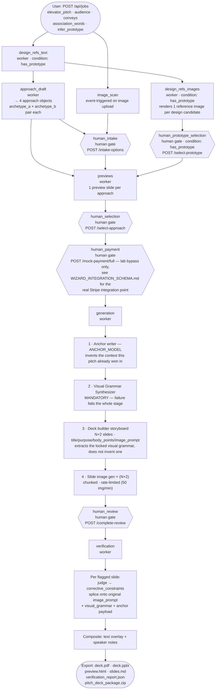

# Pitch Synthase v2 — Pipeline DAG

This is the actual stage graph registered in `ribotome.py` via
`register_stage()`, dispatched by `_advance()` off each job's
`stage_states` map — not a linear script. Companion doc: `architecture.md`
(component-level detail), `WIZARD_INTEGRATION_SCHEMA.md` (REST contract).



## Stage dependency table

| stage | depends on | condition |
|---|---|---|
| `design_refs_text` | — | `has_prototype` |
| `approach_draft` | `design_refs_text` | — |
| `image_scan` | — (event-triggered) | — |
| `human_intake` | `approach_draft` | — |
| `design_refs_images` | `design_refs_text` | `has_prototype` |
| `human_prototype_selection` | `design_refs_images` | `has_prototype` |
| `previews` | `approach_draft`, `human_prototype_selection`, `human_intake` | — |
| `human_selection` | `previews` | — |
| `human_payment` | `human_selection` | — |
| `generation` | `human_payment` | — |
| `human_review` | `generation` | — |
| `verification` | `human_review` | — |

When `has_prototype` (the job's `infer_prototype` flag) is false,
`design_refs_text`, `design_refs_images`, and `human_prototype_selection`
are auto-skipped (`stage_states[id] = "skipped"`) rather than routed around
— `previews` still fires once its other two dependencies clear.

## Job status column (legacy layer, still written alongside `stage_states`)

The `jobs.status` string column predates the stage-DAG rewrite and is still
updated by workers as a human-readable summary, but it is not what the
dispatcher reads — `stage_states` is authoritative. Observed values on the
primary (SAWC) path:

```
created
  → approaches_ready       (approach_draft worker done)
  → paid                   (human_payment gate satisfied)
  → generating_plan        (generation worker started)
  → rendering_slides       (storyboard complete, images rendering)
  → awaiting_review        (all slides rendered)
  → review_received        (human_review gate satisfied)
  → complete               (verification worker done)
  → stage_failed:{stage_id}  (any stage raises — includes the stage id)
```

`candidate_ready`, `template_*` status values also exist in `workers.py`
but belong to the legacy Path A workers (`template_worker`,
`candidate_worker`, `convert_generation_worker`) — not reachable from the
primary DAG above.

## Rate limits

| Call type | Limit | Enforced by |
|---|---|---|
| `gpt-image-2` | 50 img/min | `_throttle_image_generation()`, process-wide rolling window (`workers.py`, `_IMAGE_RATE_LIMIT = 50`) |
| Text models | not throttled | not a bottleneck at current volume |
